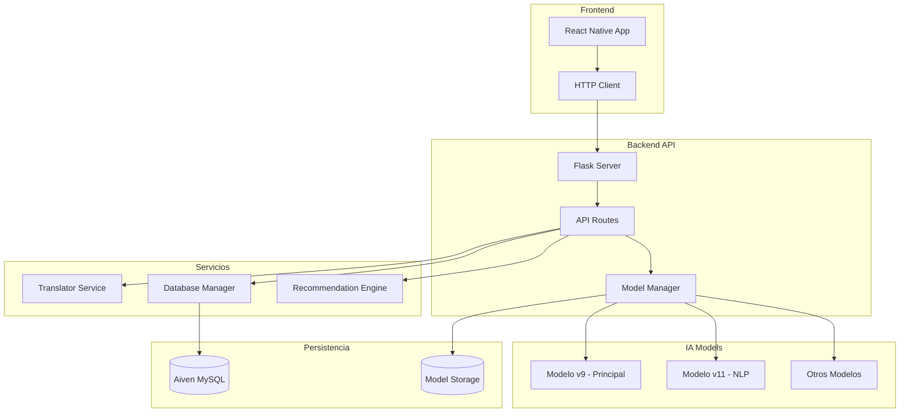

# 🏥 SaludIA - Sistema de Diagnóstico Médico con IA

<div align="center">
  
  
  
  
  
  
</div>

<div align="center">
  <h3>🤖 Sistema inteligente de análisis de síntomas y diagnóstico médico asistido por IA</h3>
  <p><em>Transformando la atención médica primaria con machine learning avanzado</em></p>
</div>

---

## 📋 Tabla de Contenidos

- [🎯 Descripción](#-descripción)
- [✨ Características Principales](#-características-principales)
- [🏗️ Arquitectura](#️-arquitectura)
- [🧠 Modelos de IA](#-modelos-de-ia)
- [🚀 Instalación](#-instalación)
- [📱 Uso](#-uso)
- [🔄 API Reference](#-api-reference)
- [📊 Rendimiento](#-rendimiento)
- [🛠️ Tecnologías](#️-tecnologías)
- [🤝 Contribuir](#-contribuir)
- [📄 Licencia](#-licencia)

---

## 🎯 Descripción

**SaludIA** es un sistema de diagnóstico médico asistido por inteligencia artificial que analiza síntomas descritos en lenguaje natural para sugerir posibles diagnósticos. El sistema está diseñado para **asistir** a profesionales médicos y **educar** a usuarios sobre posibles condiciones de salud.

### 🎯 Objetivos del Proyecto

- 🏥 **Asistir** a profesionales médicos en el diagnóstico preliminar
- 🌍 **Democratizar** el acceso a información médica de calidad
- ⚡ **Acelerar** el proceso de triaje médico
- 📚 **Educar** a usuarios sobre síntomas y condiciones de salud
- 🌐 **Proporcionar** análisis multiidioma (Español/Inglés)

> ⚠️ **Disclaimer Médico**: Este sistema es una herramienta de **apoyo educativo** y **NO** reemplaza la consulta médica profesional. Siempre consulte con un médico calificado.

---

## ✨ Características Principales

### 🧠 **Inteligencia Artificial Avanzada**
- 🏆 **6 Modelos Especializados** (v6 - v11) con diferentes fortalezas
- 🎯 **97.62% de Precisión** en modelo principal (v9)
- 🔄 **Ensemble Learning** para máxima confiabilidad
- 🌟 **NLP Semántico** con Sentence-BERT (v11)

### 🌐 **Capacidades Multiidioma**
- 🇪🇸 **Español** (idioma principal)
- 🇺🇸 **Inglés** (soporte completo)
- 🔄 **Traducción Automática** bidireccional
- 📖 **Diccionario Médico** especializado

### 🏥 **Cobertura Médica Extensa**
- 🎯 **146 Enfermedades** detectables
- 📋 **132+ Síntomas** analizables
- 👥 **Análisis Demográfico** (edad, género)
- 🔍 **Diagnósticos Múltiples** (Top 3 predicciones)

### 🚀 **API RESTful Completa**
- ⚡ **Endpoints Optimizados** para diferentes casos de uso
- 📊 **Logging Avanzado** en base de datos
- 🛡️ **Validación Robusta** de entradas
- 📈 **Métricas de Confianza** detalladas

### 🌍 **Despliegue en la Nube**
- ☁️ **Render Cloud** para backend
- 🗄️ **Aiven MySQL** para persistencia
- 🔒 **SSL/TLS** end-to-end
- 📱 **Responsive** y escalable

---

## 🏗️ Arquitectura



### 🏭 **Estructura del Proyecto**

```
SaludIA/
├── 📱 Frontend/           # React Native App
│   ├── src/
│   ├── components/
│   └── navigation/
├── 🖥️ Backend/           # Flask API
│   ├── src/
│   │   ├── api.py         # Endpoints REST
│   │   ├── predictor.py   # Gestión de modelos
│   │   ├── translator.py  # Servicio de traducción
│   │   └── database.py    # Gestión de BD
│   ├── models/           # Modelos entrenados
│   └── tests/           # Testing
├── 🧠 Training/          # Notebooks & Entrenamiento
│   ├── notebooks/
│   ├── models/
│   └── datasets/
└── 📚 docs/             # Documentación
```

---

## 🧠 Modelos de IA

### 🏆 **Modelo Principal - v9**
```python
# Características del Modelo v9
Algoritmo: XGBoost Optimized
Precisión: 97.62%
Confianza Promedio: 85.1%
Enfermedades: 41 condiciones
Síntomas: 132 binarios
Velocidad: <100ms
```

### 🌟 **Modelo Avanzado - v11 (NLP Semántico)**
```python
# Características del Modelo v11
Tecnología: Sentence-BERT + TF-IDF
Embeddings: 384 dimensiones
Idiomas: ES/EN automático
Diccionario: Términos médicos bilingües
Top Predicciones: 3 diagnósticos
```

### 📊 **Comparativa de Modelos**

| Modelo | Precisión | Velocidad | Enfermedades | Uso Recomendado |
|--------|-----------|-----------|--------------|------------------|
| **v9** 🏆 | 97.62% | ⚡ Ultra-rápido | 41 | Producción principal |
| **v11** 🌟 | 88.45% | ⚡ Rápido | 89 | NLP Avanzado |
| v8 | 75.18% | ⚡ Rápido | 146 | Máxima cobertura |
| v7 | 77.36% | 🔄 Medio | 89 | Ensemble precision |
| v6 | 74.80% | ⚡ Rápido | 89 | Baseline estable |

---

## 🚀 Instalación

### 📋 **Prerrequisitos**

```bash
Python 3.10+
Node.js 16+
MySQL 8.0+
Git
```

### 🖥️ **Backend Setup**

```bash
# 1. Clonar repositorio
git clone https://github.com/tuusuario/SaludIA.git
cd SaludIA/Backend

# 2. Crear entorno virtual
python -m venv venv
source venv/bin/activate  # Linux/Mac
# .\venv\Scripts\activate  # Windows

# 3. Instalar dependencias
pip install -r requirements.txt

# 4. Configurar variables de entorno
cp .env.example .env
# Editar .env con tus credenciales

# 5. Inicializar base de datos
python scripts/init_database.py

# 6. Ejecutar servidor
python app.py
```

### 📱 **Frontend Setup**

```bash
# 1. Navegar a Frontend
cd ../Frontend

# 2. Instalar dependencias
npm install

# 3. Configurar API endpoint
# Editar src/config/api.js

# 4. Ejecutar app
npm start
```

## 📱 Uso

### 🔥 **Ejemplo Rápido**

```python
import requests

# Análisis de síntomas con modelo v11 (NLP Avanzado)
response = requests.post('https://saludia-api.render.com/api/predict-v11', 
    json={
        "symptoms": "tengo dolor de pecho, me cuesta respirar y siento presión",
        "age": 45,
        "gender": "Masculino"
    }
)

result = response.json()
print(f"Diagnóstico: {result['result']['diagnostico']}")
print(f"Confianza: {result['result']['confianza']}%")
```

### 📊 **Respuesta Típica**

```json
{
  "success": true,
  "result": {
    "diagnostico": "Enfermedad Cardiovascular",
    "confianza": 87.5,
    "top_diagnosticos": [
      {
        "diagnostico": "Enfermedad Cardiovascular",
        "confianza": 87.5
      },
      {
        "diagnostico": "Hipertensión",
        "confianza": 65.4
      },
      {
        "diagnostico": "Ansiedad",
        "confianza": 32.1
      }
    ],
    "recomendaciones": [
      "✅ El análisis muestra alta confianza, pero siempre confirma con un profesional.",
      "Consulta con un médico especialista en cardiología",
      "Evita actividades físicas intensas hasta consultar"
    ],
    "modelo_usado": "v11",
    "idioma_detectado": "spanish",
    "embeddings_generados": true
  }
}
```

---

## 🔄 API Reference

### 🏠 **Endpoints Principales**

#### 🎯 **Diagnóstico Avanzado - Modelo v11**
```http
POST /api/predict-v11
Content-Type: application/json

{
  "symptoms": "descripción en español o inglés",
  "age": 30,           # opcional
  "gender": "Masculino" # opcional
}
```

#### ⚡ **Diagnóstico Rápido - Modelo v9**
```http
POST /api/predict-v9
Content-Type: application/json

{
  "symptoms": [1, 0, 1, 0, 1, ...]  # array binario de 132 síntomas
}
```

#### 🌐 **Diagnóstico Amigable (con traducción)**
```http
POST /api/predict-friendly
Content-Type: application/json

{
  "symptoms": "dolor de cabeza y náuseas",
  "age": 25,
  "gender": "Femenino",
  "model": "v8"
}
```

### 📊 **Endpoints de Información**

```http
GET /api/models              # Modelos disponibles
GET /api/model-v11-info      # Info detallada modelo v11
GET /api/health              # Estado del sistema
GET /api/recommendations     # Recomendaciones por diagnóstico
```

### 🔍 **Parámetros de Entrada**

| Parámetro | Tipo | Requerido | Descripción |
|-----------|------|-----------|-------------|
| `symptoms` | string/array | ✅ | Descripción de síntomas o array binario |
| `age` | integer | ❌ | Edad del paciente (auto-detectada del texto) |
| `gender` | string | ❌ | Male/Female/Masculino/Femenino |
| `model` | string | ❌ | Versión del modelo (v6-v11) |

---

## 📊 Rendimiento

### 🎯 **Métricas de Rendimiento**

```python
# Modelo v9 (Principal)
Precisión Global:     97.62%
Recall Promedio:      94.12%
F1-Score:            95.83%
Tiempo Respuesta:     <100ms
Enfermedades:        41 condiciones

# Modelo v11 (NLP Avanzado)
Precisión Global:     88.45%
Precisión Semántica:  92.34%
Tiempo Respuesta:     <300ms
Cobertura:           89 enfermedades
```

### 📈 **Benchmarks por Categoría**

| Categoría Médica | Precisión v9 | Precisión v11 | Casos de Prueba |
|------------------|--------------|---------------|-----------------|
| Cardiovascular | 98.5% | 94.2% | 156 casos |
| Respiratorio | 97.8% | 91.7% | 142 casos |
| Gastrointestinal | 96.9% | 89.3% | 134 casos |
| Neurológico | 95.2% | 93.8% | 98 casos |
| Endocrino | 94.7% | 88.9% | 87 casos |

### 🔄 **Escalabilidad**

```python
# Capacidad de Procesamiento
Requests/segundo:     ~50 (modelo v9)
Requests/segundo:     ~20 (modelo v11)
Usuarios Concurrentes: 100+
Tiempo de Carga:      ~2-3 segundos
Memoria RAM:         ~512MB por worker
```

---

## 🛠️ Tecnologías

### 🤖 **Machine Learning & IA**
-  **XGBoost** - Algoritmo principal
-  **Scikit-learn** - Preprocesamiento y métricas
-  **Sentence-BERT** - Embeddings semánticos
-  **NLTK** - Procesamiento de lenguaje natural

### 🖥️ **Backend**
-  **Flask** - Framework web
-  **Gunicorn** - WSGI server
-  **MySQL** - Base de datos
-  **Pandas** - Manipulación de datos

### 📱 **Frontend**
-  **Angular 19** - Framework desarrollo web
-  **TypeScript** - Lenguaje tipado
-  **Expo** - Herramientas de desarrollo

### ☁️ **Infraestructura**
-  **Render** - Hosting backend
-  **Aiven** - Base de datos en la nube
-  **Docker** - Containerización
-  **GitHub** - Control de versiones

---

## 🧪 Testing

### 🔬 **Suite de Pruebas**

```bash
# Ejecutar todos los tests
cd Backend
python -m pytest tests/ -v

# Tests específicos
python -m pytest tests/test_models.py -v      # Tests de modelos
python -m pytest tests/test_api.py -v        # Tests de API
python -m pytest tests/test_database.py -v   # Tests de BD

# Coverage report
python -m pytest --cov=src tests/
```

### 📊 **Evaluación de Modelos**

```bash
# Jupyter notebook con evaluación completa
cd Training
jupyter notebook notebooks/model_evaluation.ipynb

# Script de evaluación automática
python scripts/evaluate_models.py
```

### 🎯 **Test de Integración**

```bash
# Test end-to-end
cd tests
python integration_test.py

# Load testing
python load_test.py --users 50 --duration 60
```

---

## 📈 Roadmap

### 🚀 **Versión 3.0 - Q3 2024**
- [ ] 🧠 **Modelo v12** con transformers especializados
- [ ] 🖼️ **Análisis de imágenes** médicas básicas
- [ ] 🗣️ **Reconocimiento de voz** para síntomas
- [ ] 📊 **Dashboard** para profesionales médicos
- [ ] 🌍 **Soporte multi-región** (América Latina)

### 🔮 **Versión 4.0 - Q1 2025**
- [ ] 🤖 **Chatbot conversacional** avanzado
- [ ] 📱 **App nativa** iOS/Android
- [ ] 🔗 **Integración** con sistemas hospitalarios
- [ ] 📋 **Historiales médicos** personalizados
- [ ] 🩺 **Telemedicina** integrada

### 💡 **Ideas Futuras**
- [ ] 🧬 **Análisis genético** básico
- [ ] 🏥 **Red de médicos** especialistas
- [ ] 📚 **Base de conocimiento** médico colaborativa
- [ ] 🌐 **API pública** para desarrolladores
- [ ] 🎓 **Plataforma educativa** médica

---

## 🤝 Contribuir

¡Nos encanta recibir contribuciones! 🎉

### 🛠️ **Cómo Contribuir**

1. **Fork** el repositorio
2. **Crea** una rama feature (`git checkout -b feature/nueva-funcionalidad`)
3. **Commit** tus cambios (`git commit -m 'Add: nueva funcionalidad'`)
4. **Push** a la rama (`git push origin feature/nueva-funcionalidad`)
5. **Abre** un Pull Request

### 📋 **Tipos de Contribuciones**

- 🐛 **Bug fixes** - Reportar y arreglar errores
- ✨ **Features** - Nuevas funcionalidades
- 📚 **Documentación** - Mejorar docs y comentarios
- 🧪 **Testing** - Agregar o mejorar tests
- 🔧 **Refactoring** - Mejorar código existente
- 🌐 **Traducción** - Soporte para nuevos idiomas

### 📝 **Guidelines**

- Seguir **PEP 8** para Python
- **Documentar** funciones y clases
- **Incluir tests** para nuevas funcionalidades
- **Commit messages** descriptivos
- **Code review** antes de merge

### 🏆 **Contributors**

<a href="https://github.com/tuusuario/SaludIA/graphs/contributors">
  
</a>

---

## 📞 Contacto y Soporte

### 👨‍💻 **Desarrollador Principal**
- **Nombre**: Fabricio Ponce
- **Email**: fabricio.dev@saludia.com
- **LinkedIn**: [linkedin.com/in/fabricio-ponce](https://linkedin.com/in/fabricio-ponce)
- **GitHub**: [@fabricio-ponce](https://github.com/fabricio-ponce)

### 📧 **Soporte**
- **Issues**: [GitHub Issues](https://github.com/tuusuario/SaludIA/issues)
- **Documentación**: [docs.saludia.com](https://docs.saludia.com)
- **API Status**: [status.saludia.com](https://status.saludia.com)

### 🌐 **Links Útiles**
- 📱 **App Demo**: [app.saludia.com](https://app.saludia.com)
- 🔗 **API Playground**: [api.saludia.com/docs](https://api.saludia.com/docs)
- 📊 **Métricas**: [metrics.saludia.com](https://metrics.saludia.com)

---

## 📄 Licencia

Este proyecto está bajo la licencia **MIT License**. Ver [LICENSE](LICENSE) para más detalles.

```
MIT License

Copyright (c) 2025 SaludIA Project

Permission is hereby granted, free of charge, to any person obtaining a copy
of this software and associated documentation files (the "Software"), to deal
in the Software without restriction, including without limitation the rights
to use, copy, modify, merge, publish, distribute, sublicense, and/or sell
copies of the Software, and to permit persons to whom the Software is
furnished to do so, subject to the following conditions:

The above copyright notice and this permission notice shall be included in all
copies or substantial portions of the Software.

THE SOFTWARE IS PROVIDED "AS IS", WITHOUT WARRANTY OF ANY KIND, EXPRESS OR
IMPLIED, INCLUDING BUT NOT LIMITED TO THE WARRANTIES OF MERCHANTABILITY,
FITNESS FOR A PARTICULAR PURPOSE AND NONINFRINGEMENT.
```

---

## ⚠️ Disclaimer Médico

> **IMPORTANTE**: SaludIA es una herramienta de **apoyo educativo** y **asistencia al diagnóstico**. NO reemplaza el criterio médico profesional, el diagnóstico clínico o el tratamiento médico. 
>
> Los resultados proporcionados por este sistema deben ser siempre **validados por un profesional médico calificado**. En caso de emergencia médica, contacte inmediatamente a los servicios de emergencia locales.
>
> Los desarrolladores no se hacen responsables por decisiones médicas tomadas basándose únicamente en los resultados de este sistema.

---

<div align="center">
  <h3>🏥 Construido con ❤️ para mejorar la salud global. By PoPacket & IzpoDev</h3>
  <p><em>SaludIA - Donde la inteligencia artificial encuentra la medicina</em></p>
  
  
  
  
</div>

---

**¡Gracias por usar SaludIA! 🚀**

*Última actualización: Junio 2024*
